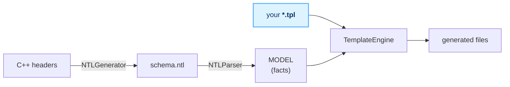

# `targets/` — Binding generator guide

Every language binding (C, Python, Android/JNI, …) is **generated** from the C++
API headers. You never hand-write per-language glue for types, functions,
exceptions, converters, you write **templates** here, and CMake renders them.

The core library (`ntgcalls/`, `wrtc/`) stays language-neutral. So does the
codegen core (`cmake/codegen/`). **All binding-specific code lives here, at
template level.**

---

## 1. The 5-minute mental model



1. **NTLGenerator** reads the C++ API headers → writes `ntl-output/schema.ntl`
   (a flat list of functions/types/enums/exceptions with C++ facts in comments).
2. **NTLParser** turns the schema into a **MODEL**: lists of `classes`,
   `structs`, `enums`, `excs`, `callbacks`, each with typed **facts**
   (`m.static`, `f.optional`, `e.code`, …).
3. **TemplateEngine** renders every `*.tpl` in `targets/<lang>/`, looping over the
   model and substituting facts. Output lands next to the `.tpl`.

You only touch **step 3** (and the two tiny CMake files below). You never edit the
generated files, they're auto-`.gitignore`d.

---

## 2. Anatomy of a target folder

```
targets/<lang>/
  something.tpl          # a template → renders to `something` (drop the .tpl)
  build.cfg              # REQUIRED: how setup.py builds/publishes this target
  build.cmake            # OPTIONAL: how to compile/link generated sources (C/C++ addons)
  finalize.cmake         # OPTIONAL: runs after the link graph is known
  support/               # OPTIONAL: hand-written helper headers (target-level)
```

- **`.tpl` → generated file**: `ntgcalls.h.tpl` renders to `ntgcalls.h`.
  Multi-file templates (Java: one class per file) use `@file`/`@endfile` instead.
- **`build.cfg`** is the data-driven descriptor `setup.py` reads (INI-style).
  `[options]` declares `workdir`, `platforms`, `tools`, `publish`, and artifact
  names; `[build]` and `[publish]` hold command blocks (`generate`, `compile`,
  `artifact`, `final`) whose lines are run in order with `{root}`, `{cmake}`,
  `{target}`, `{version}`, `{toolchain}`, … substituted. This is what feeds the
  CI matrix — adding a language never edits `build.yml`. See `targets/rust/build.cfg`
  (pure-codegen crate) and `targets/node/build.cfg` (native addon).
- **`build.cmake`** (native addons only) gets `${MODULE_SRC}` (core sources),
  `${GEN_SOURCES}` (your generated `.cpp`/`.cc`), `${GEN_INCLUDES}` (your
  `support/` dir), `${TARGET_CODE_DIR}`, `${NTG_LIB_NAME}`. Create the lib target
  there. Non-C++ targets (Rust) skip it and compile via their own toolchain in
  `build.cfg`.
- **`support/`** is where genuinely hand-written, language-specific helpers go
  (e.g. C `ntg_dup_string`). Generated code may `#include` them.

Pick the target at build time: `python setup.py build_lib --target c`. The target
name **is** the folder name, `setup.py` auto-discovers `targets/*/`.

---

## 3. Template syntax

### Substitution: `@{ ... }`

```
@{m.name}                 → the method name
@{m.name|snake}           → snake_cased
@{f.type|type|snake}      → mapped C type, then snake_cased (filters chain L→R)
```

### Filters

| filter | does | `CallInfo` → |
|--------|------|--------------|
| `snake` | camelCase → snake_case | `call_info` |
| `camel` | snake → camelCase | — |
| `pascal` | → PascalCase | `CallInfo` |
| `upper` / `lower` | case | `CALLINFO` / `callinfo` |
| `base` | strip namespace (`a.b.C` / `a::b::C` → `C`) | — |
| `slash` | `a.b.C` → `a/b/C` | — |
| `type` | apply the active `@typemap` | `ntg_CallInfo` |
| `reserve` | escape language keywords (see below) | — |
| `conv#MAP#typepath` | apply a `@wrapmap` named MAP | see below |

**`reserve`** guards identifiers that collide with target keywords. Declare the
word list and a prefix at the top of the template; a value in the list gets the
prefix, everything else passes through:

```
@config reserve_prefix = r#
@config reserved = as break const fn let match move mut type use ...   # Rust keywords
```
`@{p.name|snake|reserve}` → `type` becomes `r#type`, `chat_id` stays `chat_id`.

### Control flow

```
@for p in m.params          loop a list fact
    @{p.name}
@end

@if m.static                truthy test (empty/0/false/OFF = false)
    ...
@else
    ...
@end

@ifany a in s.fields : bytes   true if ANY item has a truthy field
    ...
@end

@skip m.name in calls,other    inside @for: skip the rest of THIS iteration
```

> `@if` tests **truthiness of a fact**, not equality. There is no `==`. To
> exclude specific items by name, use `@skip`.

### Output routing

```
@out @{config.self_dir}/ntgcalls.h      whole template → one file

@file @{config.self_dir}/Foo.java        OR: many files from one template
package x;
...
@endfile
```

---

## 4. Type mapping — `@typemap` / `@boxmap` / `@wrapmap`

Declared at the **top of a template**; they shape what `|type` and `conv#...`
produce.

### `@typemap` — schema type → target type (used by `|type`)

```
@typemap long = int64_t
@typemap string = char*
@typemap Vector<*> = *            # * captures; <...> recurses on the inner type
@typemap media.* = ntg_*          # namespace-scoped
@typemap * = ntg_*                # catch-all (put LAST)
```
Order matters, first match wins. Put specific rules (`Vector<bytes>`, `media.*`)
before general ones (`Vector<*>`, `*`).

**Trick used by C:** map scalars to lowercase C types and user types to
`ntg_*`, then chain `|type|snake`, scalars pass `snake` unchanged, user types
become `ntg_call_info`.

### `@wrapmap NAME` — value transforms (used by `conv#NAME#typepath`)

```
@wrapmap argconv long = static_cast<int64_t>($)
@wrapmap argconv * = parse#(env, $)
```
Replacement tokens: `$` = the value, `#` = simple type name (after last `.`),
`@` = slashed type (`a/b/C`). Match is on the *typepath*, `$` is the *value*:

```
@{p.name|conv#argconv#p.type}     # p.type picks the rule, p.name fills $
```

### `@boxmap` — like typemap but only when boxing is requested (`|type` on generic
args, e.g. Java `List<Integer>` not `List<int>`).

### `@importroot` — auto-collect used FQNs into import/`use` statements

Declare one or more roots; the engine finds every fully-qualified name under them
in the rendered output, replaces it with the **short name**, and emits a
deduplicated import block. Language-agnostic, you **must** set all three configs
(no defaults; the engine errors otherwise):

```
@importroot io.github.pytgcalls        # roots to scan (repeatable)

@config import_sep    = .               # namespace separator (. Java, :: for Rust-style)
@config import_line   = import $;       # statement, $ = the FQN
@config import_anchor = package         # module keyword: imports go AFTER
                                        # 'package X;' and same-module FQNs are
                                        # skipped. Use '-' to disable (imports
                                        # go to the top of the file).
```

- **Java** (`targets/android/`, the only current user): `sep = .` ·
  `line = import $;` · `anchor = package` →
  `import io.github.pytgcalls.media.CallInfo;` after `package …;`.
- **`::`-style** (e.g. a Rust target that wanted it): `sep = ::` · `line = use $;`
  · `anchor = -` → `use crate::media::CallInfo;` at the **top** of the file. (The
  current `rust/` target instead writes fully-qualified `crate::`/`sys::` paths.)

Works for both `@out` (single-file) and `@file` (multi-file) outputs.

---

## 5. The MODEL — every fact you can loop over

Top-level lists: `classes`, `structs`, `enums`, `excs`, `callbacks`,
`mapentries`, plus `config`.

### `classes` → `c`
| fact | meaning |
|------|---------|
| `c.name` | class name (`NTgCalls`) |
| `c.cpp` | fully-qualified C++ (`ntgcalls::NTgCalls`) |
| `c.methods` | list of methods |

### method (`c.methods`) → `m`
| fact | meaning |
|------|---------|
| `m.name` | camelCase name (`createP2pCall`), snake it for C++ calls |
| `m.static` | static method |
| `m.async` | async in C++ (blocking under the hood) |
| `m.iscb` | is a callback setter (skip in normal method loops) |
| `m.ret` | schema return type |
| `m.isvoid` | returns `Void` |
| `m.retstring` / `m.retbytes` / `m.retvector` / `m.retscalar` / `m.retmap` | return category |
| `m.retelcpp` | C++ element type (vector return) |
| `m.retmapkey` / `m.retmapval` | schema key/value types (map return) |
| `m.params` | input params |
| `m.hasconv` | a param is a struct or vector (needs a value-conversion pass) |
| `m.args` | async-enriched args (pybind: `.byval`, `.bytes`, `.bytetype`, `.optional`) |

> Platform-specific methods (e.g. desktop-only) aren't a fact, exclude them per
> target with `@skip m.name in <names>`.

### param (`m.params`) → `p`
`p.name`, `p.type`, `p.sep` (`,` between, empty on last), `p.scalar`,
`p.string`, `p.bytes`, `p.vector`, `p.elcpp` (vector element C++ type).

### `structs` → `s`
`s.name`, `s.cpp`, `s.ns` (namespace), `s.fields`, `s.ctorargs`, `s.ctorable`.
> Structs are **topologically sorted**: a struct's by-value dependencies come
> first, safe to emit in order.

### field (`s.fields`) → `f`
`f.name`, `f.cpp` (C++ member name), `f.type`, `f.sep`, `f.scalar`, `f.string`,
`f.bytes`, `f.vector`, `f.optional`, `f.isstruct` (nested struct, not enum),
`f.elcpp`, `f.cpptype`, `f.intenum`.

### `enums` → `e`   (members `e.members` → `mem`)
`e.name`, `e.cpp`, `e.ns`, `e.emit` (skip if false), `e.members`;
`mem.disp` (SCREAMING display name), `mem.cpp` (C++ enumerator).

### `excs` → `e`
`e.name`, `e.cpp`, `e.parent` (root category name, empty for roots),
`e.code` (grouped negative code: `-100` root, `-101…` children).
> `excs` is grouped **root then its children**; codes are `(idx+1)*100` per
> category.

### `callbacks` → `cb`   (args `cb.cbargs` → `a`)
`cb.name` (interface name), `cb.method` (C++ setter, e.g. `onStreamEnd`),
`cb.cbargs`; each `a.name`, `a.type`, `a.cpptype`, `a.sep`, `a.scalar`,
`a.string`, `a.bytes`, `a.vector`, `a.isstruct`.

### `mapentries` → `me`
One per distinct map value type: `me.keytl`, `me.valtl` (schema key/value types).

### `config` → `config.<key>`
`config.self_dir` (the `.tpl`'s folder), `config.root`, `config.banner`, plus any
`@config foo = bar` you set (`@{config.foo}`).

---

## 6. Add a new target — checklist

1. `mkdir targets/<lang>/`.
2. Write templates (`*.tpl`) using directives + facts above. Declare your
   `@typemap`s at the top; route output with `@out` or `@file`.
3. Add `build.cmake`, create the lib from `${MODULE_SRC} ${GEN_SOURCES}`, add
   `${GEN_INCLUDES}`. See `targets/c/build.cmake` / `targets/python/build.cmake`.
4. Put hand-written helpers (if any) in `support/`.
5. Build: `python setup.py build_lib --target <lang>` (auto-discovered).
6. Iterate: regenerate + compile, fix, repeat. Generated files are gitignored.

### Regenerate + eyeball without a full build

```cmake
# gen.cmake
set(ROOT_DIR "/path/to/ntgcalls")
set(BINDING "c")                      # your target folder
include(${ROOT_DIR}/cmake/codegen/GenerateSchema.cmake)
include(${ROOT_DIR}/cmake/codegen/GenerateBinding.cmake)
```
```
cmake -P gen.cmake        # writes targets/c/*  (no compile)
```

This standalone path is fast but skips libwebrtc, so webrtc-derived types (e.g.
the `VideoRotation` enum) are absent. For the **complete** language-agnostic
schema — the canonical `ntl-output/schema.ntl` that CI ships as `ntgcalls.tl` —
run `python setup.py generate`. It does a `-DSCHEMA_ONLY=ON` configure (all
`Find*` run so webrtc is downloaded) but skips `GenerateBinding` and the C++
build.

---

## 7. Gotchas

- **`@if` is truthiness only.** No `==`. Exclude by name with `@skip`.
- **Typemap order.** Specific before general; `* = …` goes last.
- **Trailing vs leading commas.** Use `@{x.sep}` (empty on last item) for
  trailing-comma lists; guarantee a fixed last element (a handle, `void*
  user_data`, an out-param) so the final item never dangles a comma.
- **Two-phase C++ lookup.** If a generated template function calls an overload on
  a generated type, define the overload **before** the template that uses it.
- **Binding code stays here.** Never push language-specific code into
  `ntgcalls/` or `cmake/codegen/`. If you need a new *neutral* fact (a type
  category, an ordering), add it to `NTLParser`, but keep the language part in the
  template.

---

Reference targets: **`c/`** (idiomatic C: opaque handle, `ntg_result` codes,
blocking, typed frees), **`python/`** (pybind11), **`android/`** (JNI + Java),
**`rust/`** (two crates from one template: `ntgcalls-sys` raw FFI + `ntgcalls`
safe async wrapper — real enums, `tokio::spawn_blocking`, `|reserve` keyword
escaping). Read one alongside this guide, the patterns repeat.
